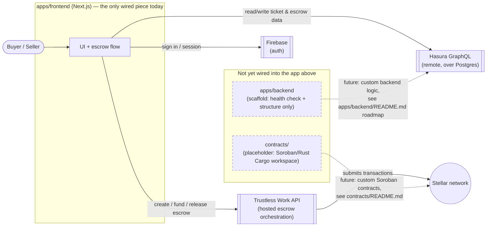

# Architecture

This diagram covers every external service `apps/frontend` (the only piece
of this monorepo that does real work today — see the root
[`README.md`](../README.md#️-this-is-a-monorepo)) talks to, and where the
currently-unwired `apps/backend` and `contracts/` scaffolds are intended to
sit once they're wired in.

## Reading the diagram

- **Solid arrows** are live today: the frontend is the only piece of this
  monorepo that talks to anything else, and it does so directly — there is
  no local backend or contract deploy required to run it (see the root
  [`README.md`](../README.md#️-this-is-a-monorepo) and
  [`apps/frontend/README.md`](../apps/frontend/README.md) for the full
  setup).
- **Dashed arrows** are where `apps/backend` and `contracts/` are intended
  to plug in once built out — they exist today only as scaffolds/placeholders
  (see [`apps/backend/README.md`](../apps/backend/README.md)'s roadmap and
  [`contracts/README.md`](../contracts/README.md)) and neither is called by
  the frontend yet.
- `docker-compose.yml` at the repo root brings up a **local** Postgres +
  Hasura stack as an alternative to the remote Hasura endpoint the frontend
  uses by default — not shown separately above since it's the same Hasura
  box in the diagram, just self-hosted instead of remote.

## Services at a glance

| Service | Role | Wired in today? |
| --- | --- | --- |
| Firebase | User authentication | ✅ |
| Hasura (+ Postgres) | Ticket & escrow data (GraphQL) | ✅ (remote by default; `docker-compose.yml` for local) |
| Trustless Work API | Escrow creation, funding, transfer confirmation, release, arbitration | ✅ |
| Stellar network | Underlying ledger Trustless Work settles escrow transactions on | ✅ (via Trustless Work, not called directly by the frontend) |
| `apps/backend` | Future custom backend logic | ❌ scaffold only |
| `contracts/` | Future custom Soroban contracts | ❌ placeholder only |
