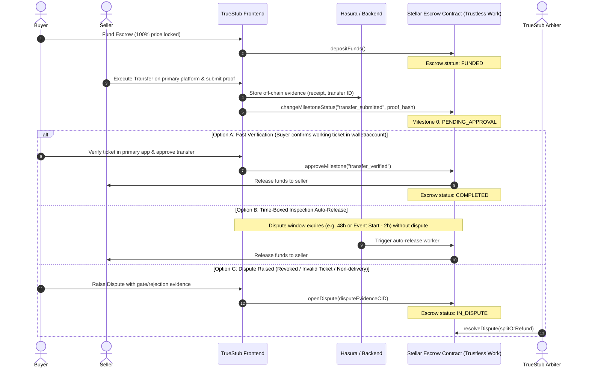

# Design: Ticket-Transfer Verification Mechanism Before Escrow Release

**Status**: Proposed  
**Author**: TrueStub Architecture Team  
**Issue Reference**: #42  
**Related Components**: `apps/frontend/src/components/events/EventMilestoneActions.tsx`, `TicketTransferApproval.tsx`, `TicketTransferCompletion.tsx`, `@trustless-work/escrow`

---

## 1. Executive Summary

TrueStub's core value proposition is trustless peer-to-peer ticket resale: **funds are held securely in Stellar smart contracts via Trustless Work and only released to the seller once transfer of a verified, valid ticket is confirmed**.

This document defines:
1. What "verified ticket transfer" means across different ticketing ecosystems.
2. The multi-tiered verification protocols (from P2P proof-of-transfer to gate-scan auto-release).
3. The boundary between on-chain contract state and off-chain evidence storage.
4. Handling of critical edge cases (revoked tickets, partial transfers, event cancellations, buyer ghosting).
5. Concrete integration with TrueStub's existing milestone UI components (`EventMilestoneActions.tsx` and related hooks).

---

## 2. The Verification Challenge in Ticket Resale

Unlike physical hospitality check-ins (where physical presence at a front desk confirms service delivery), secondary ticket transfers present unique technical challenges:
- **Primary Ticketing Fragmentation**: Tickets live in closed ecosystems (Ticketmaster Transfer, AXS Mobile ID, SeatGeek, Eventbrite, DICE, PDF/Apple Wallet PKPASS).
- **Asymmetric Knowledge**: A seller can claim they sent a transfer email, while a buyer can claim they never received it or that the barcode was invalid at the gate.
- **Double-Spend / Revocation Risk**: Screenshots or static PDF barcodes can be resold multiple times or revoked by the original purchaser before the event.

To protect both parties, TrueStub establishes a **Verification Lifecycle** backed by smart contract milestones and evidence anchoring.

---

## 3. Verification Architecture & Tiers

TrueStub implements a tiered verification model accommodating both immediate transfer verification and event-day admission verification:



### 3.1 Verification Tiers

1. **Tier 1: Account-to-Account In-App Transfer Confirmation (Standard)**
   - *Supported systems*: Ticketmaster Transfer, AXS Transfer, DICE send-to-friend.
   - *Mechanism*: Seller initiates an official transfer to the buyer's email/account. The buyer receives and accepts the ticket into their official account, rotating the digital barcode.
   - *Verification Action*: Buyer confirms receipt via TrueStub UI or system verifies transfer acceptance via confirmation proof.
   - *Dispute Window*: Buyer has a configurable inspection window $T_{\text{inspect}}$ (default: 48 hours, or up to 2 hours before event start, whichever is sooner) to verify ticket validity in their official ticketing app.

2. **Tier 2: Gate-Scan & Admission Clearance (High-Value / PDF / Static Barcodes)**
   - *Supported systems*: PDF e-tickets, non-transferable event badges, VIP packages.
   - *Mechanism*: Escrow milestone release is held until the scheduled event start time ($T_{\text{event}}$).
   - *Verification Action*: If no invalid-entry claim is filed within $T_{\text{event}} + 2\text{ hours}$, milestone auto-approves and releases funds to seller. If buyer is denied entry, buyer uploads gate rejection proof to lock funds into arbitration.

3. **Tier 3: Automated Primary Provider Webhook / API Verification (Future Integration)**
   - *Mechanism*: Direct API hooks with ticket issuers to programmatically verify transfer completion and ticket authenticity.

---

## 4. Evidence Storage: On-Chain vs. Off-Chain

To balance Stellar ledger efficiency with cryptographic verification, TrueStub partitions evidence across on-chain contracts and secure off-chain storage:

| Data Type | Storage Location | Privacy & Security | Purpose |
|---|---|---|---|
| **Escrow Contract State** | On-chain (Stellar / Soroban) | Public / Immutable | Balance, state machine, milestone approvals, participant addresses |
| **Evidence Hashes (SHA-256 / IPFS CID)** | On-chain (Custom Milestone Metadata) | Public / Tamper-proof | Anchors the exact off-chain proof submitted at approval time |
| **Timeout & SLA Timestamps** | On-chain (Contract Metadata) | Public | Enforces deterministic dispute windows and auto-release deadlines |
| **Transfer Confirmation Receipts** | Off-chain (Hasura / Encrypted S3) | Encrypted / Authenticated | Primary platform transfer emails, confirmation IDs, buyer screenshots |
| **Raw Ticket Assets (PDF / PKPASS / Barcodes)** | Off-chain (Encrypted Vault / IPFS) | Zero-Knowledge / Encrypted | Delivered securely to buyer only upon escrow funding |
| **Dispute Records & Gate Rejection Proofs** | Off-chain (Encrypted Hasura) | Restricted to Buyer, Seller & Arbiter | Box office error printouts, timestamped scan rejection photos, audio/video |

---

## 5. Integration with Existing Escrow Milestone Flow

The frontend milestone actions currently reside in `apps/frontend/src/components/events/EventMilestoneActions.tsx` (the post-rename equivalent of `HotelMilestoneActions.tsx`), along with `TicketTransferApproval.tsx` and `TicketTransferCompletion.tsx`.

### 5.1 Redesigning Milestone Actions for Ticket Resale

The legacy hospitality model used a two-stage check-in (70%) and check-out (30%) milestone split. The ticket resale verification model transitions to:

```
[Milestone 0: Transfer & Delivery Verification]
  ├── Seller Action: Submits transfer confirmation ID / delivery proof.
  ├── Buyer Action: Inspects ticket and signs milestone approval.
  └── Result: Full escrow funds released to seller upon valid transfer.

[Milestone 1 (Optional - High-Risk/VIP Listings): Event Entry Clearance]
  ├── 80% released upon verified digital transfer.
  ├── 20% held until event completion / gate admission.
  └── Auto-released 2 hours post-event if no gate-scan dispute opened.
```

### 5.2 Component Integration Spec

1. **`EventMilestoneActions.tsx`**:
   - Inspects `escrow.status` and `escrow.nextMilestone`.
   - Renders **"Submit Transfer Proof"** when `userRole === 'seller'` and status is `funded`.
   - Renders **"Verify & Release Payment"** / **"Report Issue"** when `userRole === 'buyer'` and status is `transfer_submitted` or `funded`.
   - Displays real-time countdown timer for the dispute/inspection window ($T_{\text{inspect}}$).

2. **`TicketTransferApproval.tsx`**:
   - Replaces the legacy `roomNumber` / `wifiPassword` fields with:
     - `transferPlatform` (e.g. Ticketmaster, AXS, SeatGeek, Direct PDF).
     - `transferConfirmationCode` (Primary ticket transfer reference).
     - `recipientEmail` (Buyer's verified ticket account email).
     - `proofAttachment` (Upload confirmation screenshot or forward email).
   - Generates SHA-256 hash of proof metadata and attaches it to `ApproveMilestone` or `ChangeMilestoneStatus` contract invocation.

3. **`TicketTransferCompletion.tsx`**:
   - Handles final post-event release or buyer receipt acknowledgment.
   - Provides one-click dispute escalation with structured evidence upload form (reason, photo of ticket scanner error, notes).

---

## 6. Edge Cases & Protocol Mitigations

### 6.1 Revoked / Duplicate / Invalid Ticket at the Gate
- **Scenario**: Seller transfers ticket, buyer confirms receipt, but seller previously duplicated barcode or cancelled order with primary provider.
- **Protocol**:
  1. If buyer reaches venue and ticket scan fails, buyer opens **Emergency Dispute** in TrueStub within $T_{\text{event}} + 2\text{ hours}$.
  2. Buyer submits photo of box office scanner error ("Already Scanned", "Revoked By Purchaser", "Invalid Barcode").
  3. Contract escrow is frozen; Trustless Work arbiter reviews box office timestamp vs seller transfer timestamp.
  4. On confirmed invalid ticket, arbiter slashes seller payout and refunds 100% of escrow to buyer.

### 6.2 Buyer Non-Responsiveness / Ghosting
- **Scenario**: Seller transfers ticket correctly to buyer's Ticketmaster account. Buyer receives ticket but ignores TrueStub app to delay payment release.
- **Protocol**:
  1. Once seller marks milestone `transfer_submitted` with valid transfer ID, an on-chain timeout countdown starts (48 hours).
  2. Buyer receives email/SMS notification to inspect and confirm.
  3. If buyer takes no action and files no dispute before timeout or before event start ($T_{\text{event}} - 2\text{h}$), the contract auto-approves release to seller via automated keeper worker.

### 6.3 Partial Ticket Transfer (e.g., 2 of 4 tickets delivered)
- **Scenario**: Listing was for 4 adjacent tickets, but seller only had 2 or transferred 2.
- **Protocol**:
  1. Buyer selects "Partial Transfer Received" in `EventMilestoneActions`.
  2. UI calculates pro-rata split or gives buyer choice to reject entire transfer or accept partial transfer.
  3. If accepted partially, buyer signs milestone approving release of 50% funds, and remaining 50% is refunded to buyer.

### 6.4 Event Cancellation or Rescheduling
- **Scenario**: Concert or sporting match is cancelled by promoter or rescheduled to a date buyer cannot attend.
- **Protocol**:
  1. **Cancelled**: In secondary resale, primary ticket provider automatically refunds original purchaser (the seller). TrueStub smart contract triggers cancellation refund, releasing 100% escrowed funds back to the buyer.
  2. **Rescheduled**: Tickets remain valid for new date. If transfer was already completed, ticket remains with buyer. If transfer was pending, seller must deliver updated ticket by new deadline or buyer can request cancellation.

### 6.5 Seller Non-Delivery / Missed Transfer SLA
- **Scenario**: Buyer deposits funds, but seller does not initiate transfer within agreed SLA (e.g., within 24 hours or before $T_{\text{event}} - 4\text{h}$).
- **Protocol**:
  1. Once SLA timer expires without `transfer_submitted` from seller, buyer gets one-click **"Claim Full Refund"** action.
  2. Smart contract cancels escrow and returns funds to buyer without needing arbiter intervention.

---

## 7. Implementation Roadmap & Next Steps

1. **Schema & Component Refactor**:
   - Update `apps/frontend/src/components/events/types.ts` to replace remaining hotel fields (`roomNumber`, `wifiPassword`) with `TransferData` fields (`transferCode`, `platform`, `evidenceUrl`, `evidenceHash`).
   - Wire `EventMilestoneActions.tsx` to handle the revised verification state machine.
2. **Backend Webhook Integration (`apps/backend`)**:
   - Implement webhook listener for Trustless Work escrow status transitions to sync off-chain Hasura database state.
   - Implement automated keeper service for expiration of time-boxed inspection windows.
3. **Arbiter Tooling**:
   - Provide administrative dispute dashboard for reviewing off-chain evidence hashes against on-chain escrow states.
